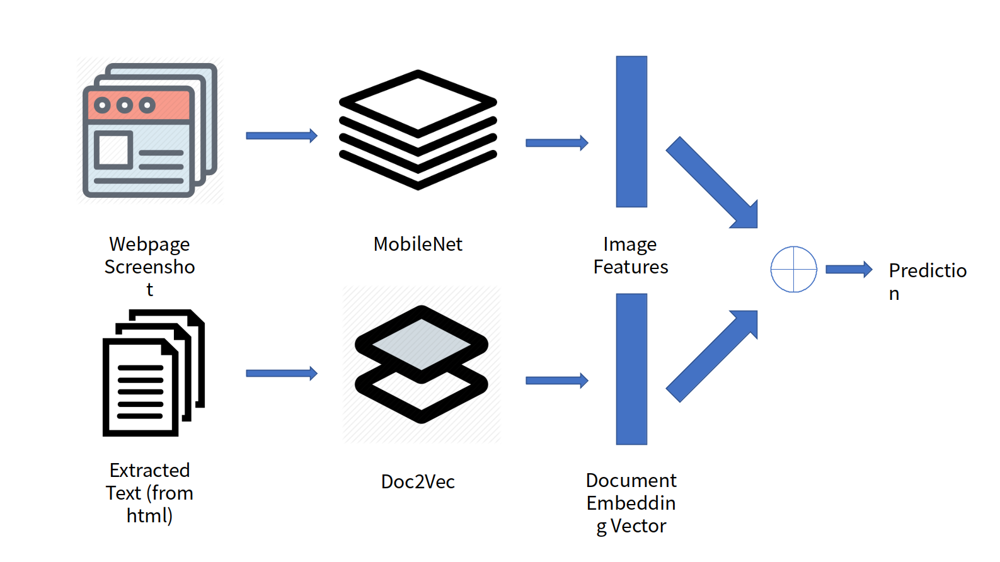

# Project of Team Aelous in Google ML Winter Camp 2020, Shanghai Site
13 - 17 January, 2020

Project Name: Webpage Wizard

Team Members: Muge Chen, Yujie Lu & Yanqiong Chen
## 1. Project Introduction
In the world of machine learning, people train models based on dataset that are
fully labeled. However, most of the application domain suffers from not having sufficient labeled 
data whereas unlabeled data is available cheaply. And our project also faced
the same problem. Specifically, we try to do webpage classification on a dataset 
that **only a small amount of data is labeled**. 

Here is the basic information of our dataset
- Dataset name: webpage-classification
- Data size: 10K pairs of {web page screenshot image, web page html source}.
- 800 samples are manually labeled {is_entity, category}
- 2590 samples are manually labeled {is_entity}

Our model aims to solve such a challenging issue 
by semi-supervised learning combined with some rule based methods. 

## 2. Implementation Details
First we did some pre-processing on the dataset. 
* We crop and resize the render images to a fixed size 
of `(224,224,3)`. 
* We use a html parser to extract useful information from the 
html data. And use word2vec to process the extracted information. 
* We convert the given labels to probability of different 
categories.  
* We also write a script to label some of the unlabeled data that 
we are 95% confident. For example, the one with url that 
starts with `wikipedia` or contains `imdb/title`, etc.

Second we build the following pipeline to classify the webpage, 
(Visualization here)

    model1(based on url) --> model2(based on html & img) --> category

We have built 2 sub-model to classify the webpage. 
### 2.1 html model
First we use html parser to parse the html into plain text, and 
next we use doc2vec to transform the text data into a vector 
of 300 dimension. It reaches an accuracy of 80% on the dataset.

Now we train a deep learning model to do classification. 
### 2.2 image model 
We use deep CNN to train the model, and it reaches an 
accuracy of 85% on the dataset and 95% on the validation set.

### 2.3 Put together

In addition, we have put the 2 model together. That is, we use
both the html and the render to train the model, and it turns
out to perform well on the dataset.

## 3. Demo and Posters
There are many possible applications of webpage classification, for example 
* We can build an extension for Chrome which can beautify the UI with 
different strategies based on the category of the webpage. 
Just like switch omega.
* The browser can collect information about which category the user
visited most frequently to decide which AD to present.

And we have write a small demo extension as followed. 

## References
[1] S4L: Self-Supervised Semi-Supervised Learning (ICCV 2019)

[2] Mean teachers are better role models: Weight-averaged consistency 
targets improve semi-supervised deep learning results (NIPS 2017)

[3] Le, Quoc, and Tomas Mikolov. "Distributed representations of sentences and documents." International conference on machine learning. 2014.
